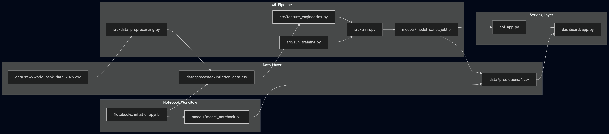
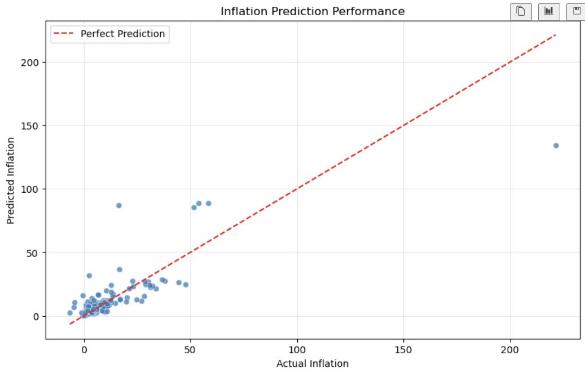

# Inflation Prediction Project

## Introduction

This project aims to predict inflation rates based on historical data. It includes a comprehensive pipeline for data processing, feature engineering, model training with hyperparameter tuning, a prediction API, and an interactive dashboard for visualizing the results.

## Project Structure



```
├── api/
│   └── app.py              # Flask API for model predictions
├── dashboard/
│   └── app.py              # Streamlit dashboard for visualization
├── data/
│   ├── predictions/
│   │   ├── predictions_notebook.csv
│   │   └── predictions_script.csv
│   ├── processed/
│   │   └── inflation_data.csv
│   └── raw/
│       └── world_bank_data_2025.csv
├── docker/
│   ├── Dockerfile.api
│   └── Dockerfile.dashboard
├── models/
│   ├── model_notebook.pkl
│   └── model_script.joblib   # Trained machine learning model
├── Notebooks/
│   └── inflation.ipynb       # Jupyter Notebook for exploratory data analysis and model development
├── src/
│   ├── data_preprocessing.py
│   ├── feature_engineering.py
│   ├── predict.py
│   ├── run_training.py
│   └── train.py
├── visuals/                  # Directory for project visuals
│   ├── project_architecture.png
│   ├── actual_vs_predicted.png
│   ├── feature_importance.png
│   └── dashboard_screenshot.png
├── .gitignore
├── docker-compose.yml
├── README.md
└── requirements.txt
```

### Key Components

*   **`api/`**: Contains the web API to serve the inflation prediction model.
*   **`dashboard/`**: Houses the interactive dashboard for data and prediction visualization.
*   **`data/`**: Stores raw, processed, and predicted data.
*   **`models/`**: Contains the serialized, trained machine learning models.
*   **`Notebooks/`**: A Jupyter Notebook detailing the entire data science workflow from exploration to model evaluation.
*   **`src/`**: Source code for data processing, feature engineering, model training, and prediction logic.
*   **`docker/`**: Dockerfiles for building the API and dashboard services.
*   **`docker-compose.yml`**: Defines and configures the multi-container Docker application.
*   **`requirements.txt`**: Lists the Python dependencies for the project.

## Data Science Workflow

The core of this project is a detailed data science workflow, which is fully documented in the `Notebooks/inflation.ipynb` notebook. The key stages are:

### 1. Data Preprocessing

*   **Data Cleaning**: Handled missing values by using forward and backward fill techniques, ensuring data integrity.
*   **Column Selection**: Selected relevant features for the model to reduce noise and improve performance.

### 2. Feature Engineering

*   **Lag Features**: Created time-lagged features for inflation and GDP growth to capture temporal dependencies.
*   **Categorical Encoding**: Applied one-hot encoding to the `Country` feature to make it suitable for machine learning models.

### 3. Model Training and Selection

A pipeline of several regression models was trained and evaluated to find the best performer.

*   **Time-Aware Splitting**: The data was split into training, validation, and test sets based on the year to prevent data leakage and simulate a real-world forecasting scenario.
*   **Models Evaluated**:
    *   Linear Regression
    *   Ridge Regression
    *   Random Forest Regressor
    *   Gradient Boosting Regressor
    *   XGBoost Regressor
*   **Best Model**: The Random Forest Regressor was selected as the best-performing model based on its high R² score and low RMSE on the validation set.

### 4. Hyperparameter Tuning

The selected Random Forest model was further optimized through hyperparameter tuning.

*   **Grid Search**: A grid search was performed to find the optimal combination of hyperparameters, such as the number of estimators and the maximum depth of the trees.
*   **Final Model**: The tuned Random Forest model demonstrated the best performance, which was then used for the final predictions.

### 5. Model Evaluation

The final model was evaluated on the test set to assess its performance on unseen data.




## Getting Started

### Prerequisites

*   Docker
*   Docker Compose

### Installation & Running the Project

1.  **Clone the repository:**
    ```bash
    git clone <repository-url>
    cd <repository-name>
    ```

2.  **Build and run the services using Docker Compose:**
    ```bash
    docker-compose up --build
    ```

This command will build the Docker images for the API and the dashboard and run them in separate containers.

*   The API will be accessible at `http://localhost:5000`
*   The dashboard will be accessible at `http://localhost:8501`

## Usage

### API

The API provides endpoints to get inflation predictions.

*   **Endpoint:** `/predict`
*   **Method:** `POST`
*   **Data:** `{ "features": [...] }`

Example using `curl`:
```bash
curl -X POST http://localhost:5000/predict \
-H "Content-Type: application/json" \
-d '{"features": [ ... ]}'
```

### Dashboard

The interactive dashboard can be used to visualize historical inflation data and see the model's predictions. Access it by navigating to `http://localhost:8501` in your web browser.


## Visuals

*(Space reserved for project visuals, such as the prediction performance graph, dashboard screenshots, or result plots.)*

<!--
Example of how to add an image:
<p align="center">
  
</p>
-->

## Contributing

Contributions are welcome! Please feel free to submit a pull request.

1.  Fork the Project
2.  Create your Feature Branch (`git checkout -b feature/AmazingFeature`)
3.  Commit your Changes (`git commit -m 'Add some AmazingFeature'`)
4.  Push to the Branch (`git push origin feature/AmazingFeature`)
5.  Open a Pull Request

## License

Distributed under the MIT License. See `LICENSE` for more information.
